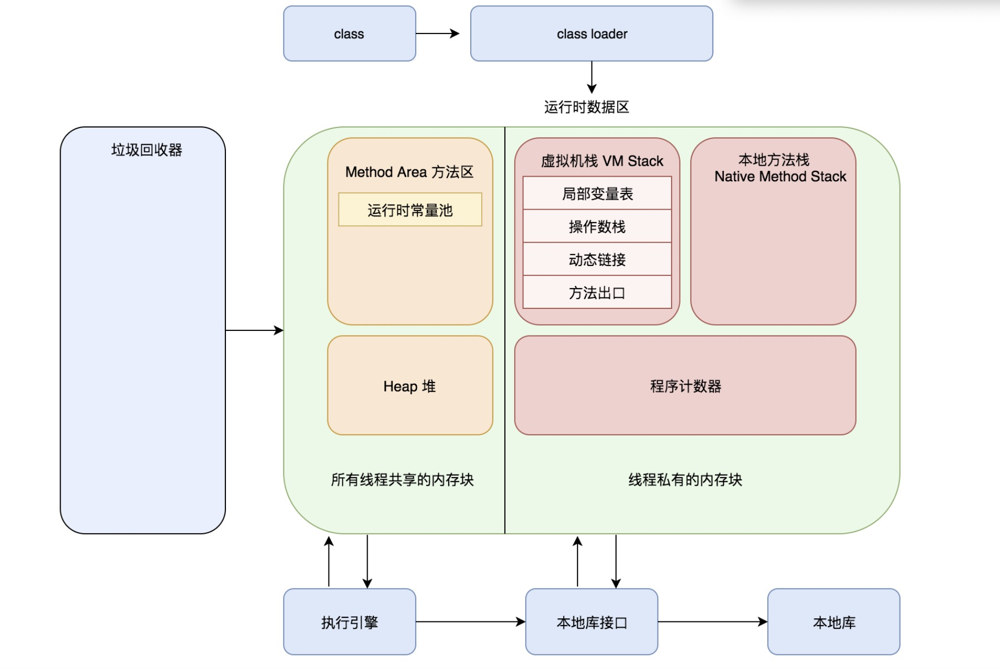
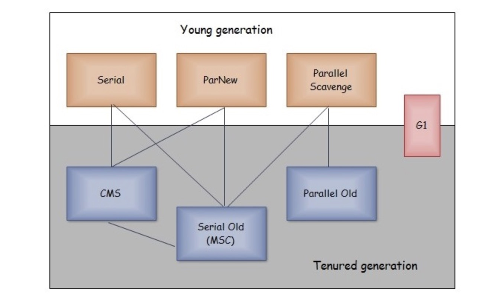

### JVM基本结构
.class -> classloader -> 运行时数据区 -> 执行引擎，本地库接口 -> 本地方法库
### JVM体系结构
虚拟机是物理机器的软件实现。java遵循write once run anywhere 理念，它运行在vm上，编译器将Java文件编译成.class文件，将
class文件输入到JVM中，加载并执行该类文件


运行时数据区 > 堆 方法区  栈 程序计数器 本地方法栈
 
### jvm是怎么工作的
- 类加载子系统 > 加载 链接 初始化

        1.加载
        这个组件负责加载类，BootStrap类加载器，Extension类加载器和Application类加载器
          1.1 BootStrap类加载器负责加载classpath下面的类，如果没有类将只加载rt.jar之歌类加载器优先级最高
          1.2 Extension类加载器负责加载扩展文件夹jre/lib中的类
          1.3 Application类加载负责加载应用级classpath和环境变量指向的路径下的类
        2.链接
          2.1 校验 字节码验证器将校验生成的字节码是否正确，如果校验失败，我们将得到校验错误信息。
          2.2 准备 对所有的静态变量，内存将被申请并分配默认值
          2.3 解析 所有的内存引用从方法区域被替换成的原始引用
        3.初始化  所有静态变量豆浆被分配值，静态代码将会被执行
- 运行时数据区

        1.java堆 堆的主要作用是存放程序创建过程中创建的对象实例，因为要存放的对象实例有可能会极多，因此也是需要虚拟机内存管理的一大块
        并且由于硬件条件有限所以需要不断回收已无用的实力对象，来腾出空间给新生成的实力对象，因此java的垃圾回收主要针对堆进行回收的，java
        堆很多时候也称为gc堆
            1.1 新生代
                在方法中new一个对象，就是新生代对象，方法执行完毕后就被回收
            1.2 老年代
                在新生代中经历了N次垃圾回收后仍然存活的对象就会被放到老年代中，而大对象直接进入老年代
                当Survivor空间不够时，需要依赖老年代进行分配担保，所以大对象直接进入老年代
            1.3 永久代--方法区
                当一个对象被创建时，它首先进入新生代，之后被转移到老年代中。
                年轻代 to from eden 1:1:8   
                老年代 tenured  
                永久代 perm
                -Xmx -Xms -XX:MaxPermSize  -XX:PermSize  -XX:NewSize -XX:MaxNewSize
        2.方法区 用于存储虚拟机加载的类信息，常量，静态变量即使编译器编译后的呆萌的等数据，线程共享
          Java1.7之前虚拟机把它当作永久代进行垃圾回收，JDK1.8之后取消了永久代，用了元数据区替代
        3.虚拟机栈 也是我们常说的栈，是java方法运行的内存结构，虚拟机会为每个java方法执行时创建一个栈帧，用于存储局部变量表，操作数栈，动态链接
        方法出口等信息。当方法执行完毕后，该栈帧会从虚拟机栈中出战。其中局部变量表高喊基本类型和对象引用
        4.本地方法栈 类似java方法的执行有虚拟机栈，本地方法的执行则对应本地方法栈。
        5.程序计数器 用于记录当前先后从那个正在执行的字节码指令位置。由于虚拟机的多线程是切换线程并分配cpu执行时间的方法实现的，不同线程的执行位置都
        需要记录下来，因此程序计数器是线程私有的
- 执行引擎

        1.解释器-解释器能更加快速地解释字节码，但是执行缓慢，解释器的缺点是当多次调用一个方法时每次都要重新解释
        2.JIT编译器-弥补解释器的不足，执行引擎使用解释器来转换字节码，当它发现重复的代码时，它将使用JIT编译器来编译
        整个字节码并转换为本地代码，本地代码将直接被重复的方法调用
        3.中间代码生成器，生成中间代码
        4.目标代码生成器，生成机器码或者本地代码
        5.分析器 一个特殊的组件负责查找热点代码
        6.垃圾回收期 回收并删除未引用的对象，可以通过system.gc来出发垃圾回收，但不能保证它执行jvm的垃圾回收被创建的对象
### 判断一个对象是否可回收
    
   程序计数器、虚拟机栈和本地方法栈这三个区域属于线程私有的，只存在于他的神谷明周期内，线程结束后也会消失，因此不需要对这三个
   区域进行垃圾回收，垃圾回收主要针对java堆和方法区进行
 - 引用计数法
   
   给对象添加一个引用计数器每当有引用他的地方计数器加1，当引用失效时候计数器减1，无法解决相互循环引用
 - 可达性分析算法
   
   通过GCRoots作为起始点进行搜索，能够达到的对象都是存活的，不可达的可被回收
   
   那些对象可以做为GC Roots对象
   1. 虚拟机栈中引用的对象
   2. 方法区中静态属性引用的对象
   3. 方法区中常量引用的对象
   4. 本地方法栈中引用的对象
 ### 引用类型
 - 强引用
    
    被强引用关联的对象不会被回收 new Object();
 - 弱引用
    
    被软引用关联的对象只有在内存不够的情况下才会被回收
    ```$xslt
        Object obj=new Object();
        SoftReference<Object> sf=new SoftReference<>(obj);
        obj=null;
    ```
 - 软引用
    
    被软引用关联的对象一定会被回收
    ```$xslt
        Object obj=new Object();
        WeakReference<Object> wf=new WeakReference<>(obj);
        obj=null;
    ```
 - 虚引用
    任何时候都能被回收

### 方法区的回收

在堆中每一次垃圾的收集一般可以回收70%-95%的空间，而永久代垃圾收集效率远低于此，永久代收集主要包括两个部分
废弃的常量和无用的类
### 垃圾收集算法
- 标记清除

首先标记出所有需要回收的对象，标记完成后统一回收所有标记的对象，效率问题效率不高 空间问题产生大量不连续的内存碎片
- 标记整理

标记过程和标记-清除算法一样，但后续不是直接清理对象，而是让所有存活的对象都向一端移动，然后直接清除边界以外的内存
- 复制

将内存划分为大小相等的两块，每次都使用其中的一块，当这一块内存用完了就将存活的对象复制到另一块上，然后再把使用过的内存进行
一次清理。
- 分代回收

新生代使用复制算法，老年代使用标记清除或者标记整理算法

### 垃圾收集器

- serial收集器

    翻译为串行，他是单线程收集器，简单高效，由于没有线程交互的开销，有较高的收集效率
    他是client默认的新生代收集器。
- ParNew(复制算法)

    是serial收集器的多线程版本
    是server模式下首选的新生代收集器，处理性能原因外，除了serial收集器，只有他能与cms收集器配合工作。
    默认开启的线程数量和cpu数量相同，可以使用-XX:ParallelGCThreads参数来设置线程数
- Parallel Scavenge

    是一个采用复制算法，并行的多线程收集器，适用于新生代。
    和ParNew的区别是，其他收集器关注于停顿时间，该收集器关注于吞吐量，可以高效率的利用cpu时间尽快的完成程序运算。
- servial Old
   
  是servial收集器的老年代版本，它同样是一个单线程收集器，使用标记整理算法

- Parallel Old
   
  是Parallel Scavenge的老年代版本，使用标记整理算法
 
- CMS（Concurrent Mark Sweep） 代表标记清除算法。有点并发收集低停顿。
    四个流程
    1. 初始标记：仅仅知识标记一下GC Roots能直接关联的对象，速度很快，需要停顿
    2. 并发标记：进行GC Roots追踪规程，他在整个回收过程中耗时最长，不需要停顿
    3. 重新标记：为了修正并发标记期间因用户程序继续运作而导致标记产生变动的那一部分对象的标记记录，需要停顿
    4. 并发清除：不需要停顿
- G1
  Oracle在jdk中将G1变成默认的收集器，代替CMS
  G1把堆划分为多个大小相等的独立区域，新生代和老年代不再需要物理隔离，引入了Region的概念，从而将一整块内存空间划分为多个
  校共建，使得诶个小空间可以单独进行垃圾回收，这种划分方法带来了很大的灵活性。使得可预测的停顿时间模型称为可能，通过记录
  每个region垃圾回收时间以及回收所获得的空间，并维护一个优先列表，每次根据允许的收集手贱，优先回收价值打得region
  每个region都有一个remembered set用来记录region对象的引用对象所在的region通过使用rememberedset在做可达性分吸的时候
  就可以避免全堆扫描。
  
      1.初始标记
      2.并发标记
      3.最终标记
        为了修正并发标记机器因用户程序继续运作产生的新垃圾。
      4.筛选回收
        首先对哥哥region中的回收价值和成本进行排序，根据用户所期望的GC停顿时间来执行回收激活。
### 内存回收与回收策略
- MinorGC FULL GC

        1. MinorGC 发生在新生代上，因为新生代对象存活时间很短，因此MinorGC会频繁执行，执行速度一般也比较快
        2. fullGC 发生在老年代上，老年代对象存活时间长，因此FullGC很少执行。执行速度比MinnorGC慢很多  
- 内存分配

        1.优先在eden上分配，大多数情况下，对象在新生代Eden区分配，当Eden区空间不够时发起Minor GC
        2.大对象直接进入老年代，大对象指的是连续内存空间的对象，最典型的是那种很长的字符串以及数组
        经常出现大对象会提前出发垃圾收集以获取足够的连续空间分配给大对象
        3.长期存活的对象进入老年代。为对象定义年龄计数器，对象在Eden出生并经过Minor GC依然存活，将转移到Survivor
        年龄就增加1岁，增加到一定年龄则移动到老年代
        4.动态对象年龄判定
        虚拟机并不是永远地要求对象的年龄必须达到MaxTenuringThreshold才能晋升到老年代，如果在survivor中相同年龄
        所有对象大小的综合大于surbibor空减的一般，则年龄大于或等于该年龄的对象可以直接进入老年代，无需等到MaxTenuringThreshold
        要求的年龄。
        5.空间分配担保
        在发生Minor GC之前，虚拟机先检查老年代最大可用连续的空间是否大于新生代对象总空间，如果条件成立，那么认为Minor GC是安全的
        如果不成立的话虚拟机会查看HandlePromotionFailure设置值是否允许担保失败，如果允许就会继续检查老年代最大可用连续空间是否大于
        历次晋升老年代对象的平均大小，如果大于则尝试进行一次MinorGC如果小于，或者不允许，那么就需要进行fullGC
- full GC条件

        1.调用Syatem.gc() 知识虚拟机建议执行fullGC 但是虚拟机不一定去执行
        2.老年代空间不足，为了避免大对象直接进入老年代，长期存活的对象进入老年代，引起FUllGC应当尽量不要创建
        大的对象和数组。除此之外可以用过可以用过-Xmn虚拟机参数调大新生代的大小，让对象尽量在新生代被回收掉。不进入老年代
        还可以通过设置-XX:MaxTenuingThreshold调大对象进入老年代的年龄，让对象在新生代多存活一段时间
        
  


    
  